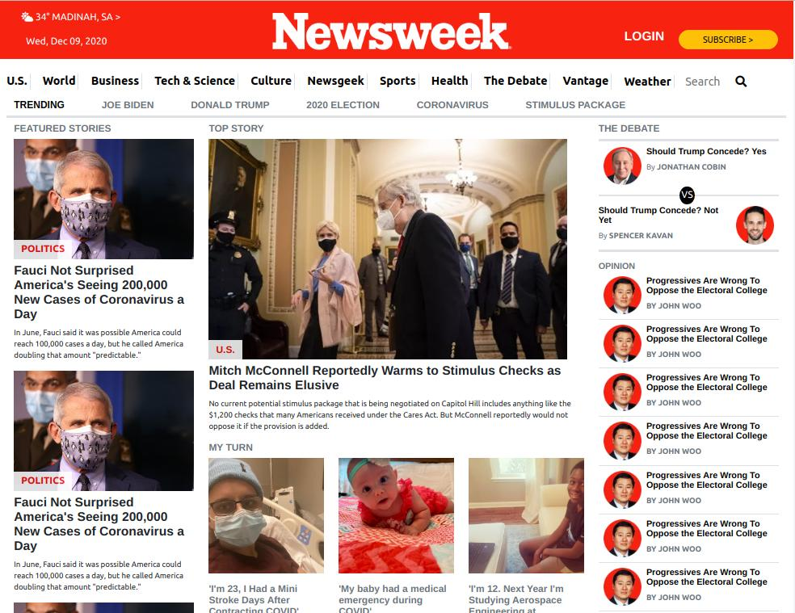
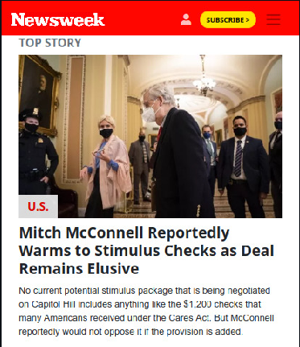

# Newsweek clone using Bootstrap

> This is a clone of [newsweek site](https://www.newsweek.com/) for HTML/CSS Microverse module.

### Desktop version

### Mobile version

Additional description about the project and its features.

## Built With

- HTML5
- CSS
- SASS
- Bootstrap

## Live Demo

[Live Demo Link](https://aliciapaz.github.io/bootstrap-newsweek/.)

## Getting Started

### Setup
Checkout the project on your web browser with the provided demo link.

### Install
No installation required.

### Deployment
Deployed on Github pages for demonstration purposes.

## Authors

👤 **Iyunda Ismael Antonio**

- GitHub: [@ixboy](https://github.com/ixboy)
- Twitter: [@ismaelixboy](https://twitter.com/ismaelixboy)
- LinkedIn: [ismael-antonio](https://www.linkedin.com/in/ismael-antonio-0b7712114/)

👤 **Alicia Rojas**

- GitHub: [@githubhandle](https://github.com/aliciapaz)
- Twitter: [@twitterhandle](https://twitter.com/aliciap38180090 )
- LinkedIn: [LinkedIn](https://www.linkedin.com/in/alicia-rojas-71468418a/ )

## 🤝 Contributing

Contributions, issues, and feature requests are welcome!

## Show your support

Give a ⭐️ if you like this project!

## Acknowledgments

- https://www.newsweek.com/
- [Bootstrap 5.0](https://getbootstrap.com/docs/5.0/getting-started/introduction/)

## 📝 License

This project is [MIT](./LICENSE) licensed.
